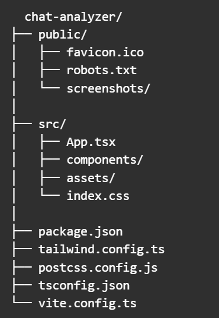
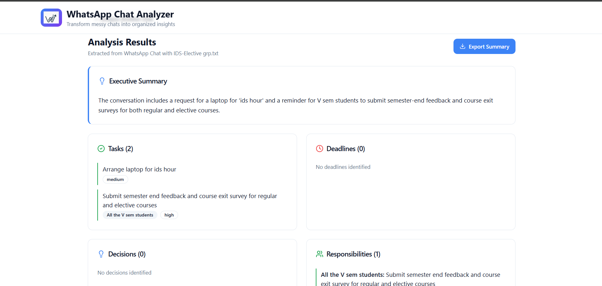

<h1 align="center">WhatsApp Chat Analyzer</h1>

<p align="center">
  <strong>Turn exported WhatsApp group chats into structured project-ready outputs.</strong><br/>
  Lightweight, fast, and designed for clear documentation & demo screenshots.
</p>

<p align="center">
  
  <a align="center" href="#"></a>
  
</p>

---

## ✨ What this is

A polished, frontend-first web application scaffold built with **React + TypeScript + Vite + Tailwind CSS**.  
It provides a clean UI for uploading WhatsApp `.txt` chat exports, selecting a date range, and attaching screenshots that document how the tool is used. This repository contains the UI only — backend/processing logic can be added later.

---

## 🚀 Highlights

- Modern, responsive UI (mobile + desktop)
- File upload (.txt) & multi-image screenshot gallery
- Date-range selection for filtering
- Export buttons for `.txt`, `.json`, and `.csv` (UI stubs)
- Easy to customize: logo, colors, layout
- Clean structure ideal for demos, portfolio, or student projects

---

## 🧭 Quick start

1. Clone
```bash
git clone <your-repo-url>
cd <project-folder>
```
2.Install
```
npm install
```
3.Start dev server
```
npm run dev
```
4.Build for production
```
npm run build
npm run preview
```

---

## 📁 Project Structure




---
### 📷 Screenshot guide 
Website hero / landing:


File input (upload area):


Date selection:


Output / results:


---
### 📄 How to Export WhatsApp Chat

### Android
1. Open the chat → tap ⋮ → **More** → **Export Chat**
2. Choose **Without Media**
3. Save the exported `.txt` file


### iPhone
1. Open the chat → tap contact/group name
2. Scroll down → **Export Chat**
3. Choose **Without Media**
4. Save to Files / AirDrop


Upload the exported `.txt` file into the app.

## 🤝 Contributing

PRs, fixes, and improvements are welcome.

## 📜 License

MIT License.
